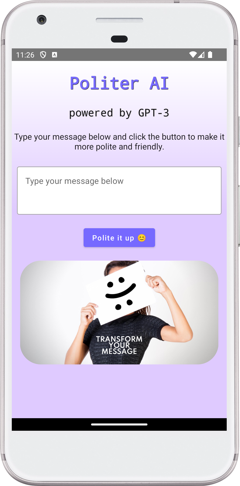

# Politer AI

This is a Kotlin Multiplatform project targeting Android, iOS, Desktop.
**Kotlin Multiplatform** is a broad technology that enables cross-platform development with Kotlin.

## PROJECT SPECIFICATION

• Programming language: [Kotlin](https://kotlinlang.org/);

• SDK: [Android](https://developer.android.com/tools);

• Framework: [Compose Multiplatform](https://www.jetbrains.com/lp/compose-multiplatform/);

• Interface: [Compose](https://developer.android.com/jetpack/compose);

• HTTP client: [Ktor](https://ktor.io);

• Reactive programming: [Coroutines](https://developer.android.com/kotlin/coroutines);

• Version control system: [Git](https://git-scm.com);

• Git Hosting Service: [GitHub](https://github.com);

• CI/CD: [GitHub Actions](https://docs.github.com/en/actions) is used to deliver new Android
Package (APK) to [Firebase App Distribution](https://firebase.google.com/docs/app-distribution)
after every push to the **dev** branch, [Codemagic](https://codemagic.io/start/) is used to deliver
new release app bundle to **Google Play** after every push to **master** branch;

• App testing platforms:
[Firebase App Distribution](https://appdistribution.firebase.dev/i/353f302e0032e469);

• App store:
[Google Play](https://play.google.com/store/apps/details?id=com.turskyi.politerai);

• Operating system: [Android](https://www.android.com/);

• Architectural pattern:
[Monolith](https://learn.microsoft.com/en-us/dotnet/architecture/modern-web-apps-azure/common-web-application-architectures#all-in-one-applications);

### Folder structure

* `/composeApp` is for code that is shared across Compose Multiplatform applications.
  It contains several subfolders:
    - `commonMain` is for code that’s common for all targets.
    - Other folders are for Kotlin code that will be compiled for only the platform indicated in the
      folder name.
* `/iosApp` contains iOS applications.

**Compose Multiplatform** is a focused library that enables cross-platform UI development with
Jetpack Compose.

• **Code Readability:** code is easily readable with no unnecessary blank lines, no unused variables
or methods, and no commented-out code, all variables, methods, and resource IDs are descriptively
named such that another developer reading the code can easily understand their function.

• Screenshots:

<!--suppress CheckImageSize -->

## Credits

This project is based on the
[Get started with Compose Multiplatform — tutorial](https://www.jetbrains.com/help/kotlin-multiplatform-dev/compose-multiplatform-getting-started.html)
by [JetBrains](https://github.com/JetBrains).